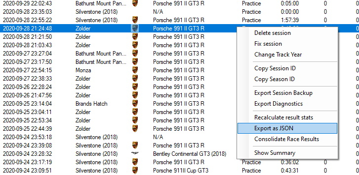
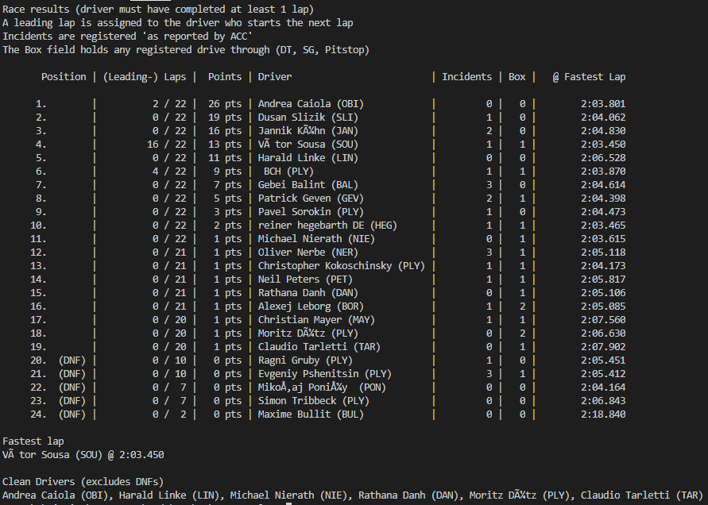

# RaceResult

This python scripts analyses the recorded data of [ACC Results Companion](https://www.racedepartment.com/downloads/acc-results-companion.28298/) in different ways, which are not supported by the Companion itself.

Note: At the moment, multi-driver teams are not supported yet (send me a json of a multi-driver race and a screenshot of the Companion result and I can implement that).

## Exporting Data

After the data is collected, go to your ACC Results Companion and export the data into a json file.

Simply open the `Session` tab and select (right-click) the race of interest. Next select `Export as JSON` and save the file into the same directory as this tool (you can save everywhere, however storing it in the same directory saves you from long directory paths)

## Starting the analysis

Simply execute the provided file [raceResults.py](raceResults.py). You can aswell use the provided [raceResults.bat](raceResults.bat) to automatically launch the python interpreter.

The batch file will ask you to input the path to the file. Do not forget to add the file ending (`.json`).
When launching the python-file, you can pass the path as argument.

Possible launch: `python3 raceResult.py "results.json"`

## No Python interpreter installed?

If you do not have a functioning python install, you can download the generated executable from the [Releases](https://github.com/Mayerch1/ACCRaceResults/releases/latest).

## Using the Output

* The output is presented as console output. The first column will show the position and `DNF` in case the driver did not finish.

* The second column shows the completed laps and the amount of laps which the driver was leading. A leading lap is counted, whenever the driver is the first one to cross the finish line (effectively triggering the next lap). 

* The third column shows the earned points for that race (FIA points, no fastest lap). One additional point is granted for finishing the race.

* The fourth column shows the number of incidents 'as reported by ACC'.

* The fifth column shows the amount of pit drive throughs like Pitstops or cleared penalties (This value is not fully tested and might show incorrect figures)

* The sixth column shows the fastest lap of that player.

Below the table the overall fastest lap and all drivers without any incidents are mentioned.

## Example Output

